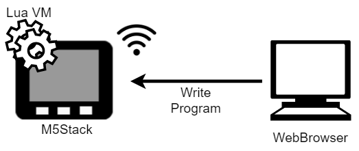
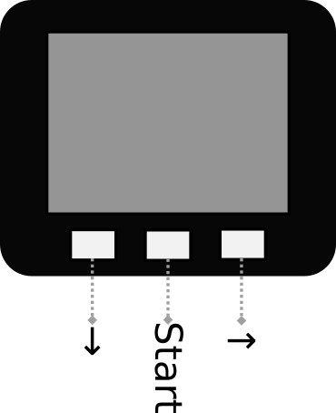
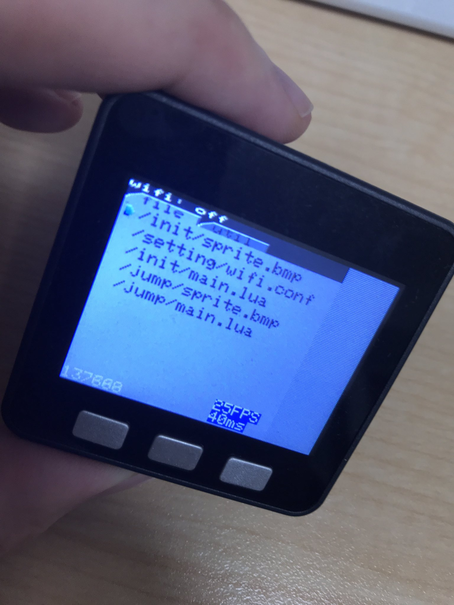

# o-bako esp32

[o-bako](https://inajob.github.io/o-bako-simulator/index.html)のESP32バージョンです。

o-bakoはLuaで記述するゲーム開発プラットフォームです。
ブラウザでゲームを開発し、そのままのソースコードがゲーム機上でも動作するのが特徴です。

o-bako-esp32 はo-bakoのESP32実装です。



# ターゲットボード

## 自作基板
ESP32-DevKitCを使った自作基板です。
詳細は後日公開予定です。

## M5Stack

M5Stack Basicで動作確認しています。
facesには未対応ですが、対応予定です。

本来o-bakoは十字キー + Start,1,2ボタンを想定していますが、M5Stack Basicには3つしかボタンがないため 下,Start,右ボタンのみが有効です。



# ビルド環境
[platformio](https://platformio.org/)を利用しています

# ビルド+アップロード方法

リポジトリのクローンとサブモジュールの更新

```
$ git clone git@github.com:inajob/o-bako-esp32.git
$ git submodule update --init --recursive
```

ビルドとm5stackへのアップロード

```
$ platformio -e m5stack --target=upload
```

# M5Stack-SD-Updaterを使った実行

M5Stackの場合は[M5Stack-SD-Updater](https://github.com/tobozo/M5Stack-SD-Updater)が利用できます。
その際は[o-bako.bin](output/o-bako.bin)をダウンロードしてSDカードに入れてください。

# 初期起動時の作業

SPIFFSの `/init/main.lua` `/init/sprite.bmp` を読み込もうとしますが、初期起動時には存在しないためエラー画面になります。

## APモードに切り替え

M5Stackの場合、中央のボタンをしばらく押して、メニューを出してください。
WiFi APを選択し右ボタンを押すと、APモードになります。

下記のような表示が出ます。

```
Starting WiFi...

o-bako-XXXXXX
ZZZZZZZ
192.168.0.1
```

o-bako-XXXXXXはWiFiのSSIDです。（XXXXXXは実行の度に変わります。）ZZZZZZZはWiFiのパスワードです。
192.168.0.1はo-bakoのIPアドレスです。

手元のパソコンを上記WiFiに繋げます。

ブラウザから `http://192.168.0.1/list/` にアクセスし、`o-bako-file list`が表示されれば準備OKです。

## ランチャーの書き込み

example/loader/init.sh を実行します。

```
$ cd example/loader
$ sh init.sh
upload /init/sprite.bmp
  % Total    % Received % Xferd  Average Speed   Time    Time     Time  Current
                                 Dload  Upload   Total   Spent    Left  Speed
100 51941    0     4  100 51937      0   7225  0:00:07  0:00:07 --:--:--     0OK

upload /init/main.lua
  % Total    % Received % Xferd  Average Speed   Time    Time     Time  Current
                                 Dload  Upload   Total   Spent    Left  Speed
100   664    0     4  100   660      3    503  0:00:01  0:00:01 --:--:--   509OK
$
```

実行が終わると、転送したプログラムが実行されます。
以降は電源を入れると、/init/main.luaが実行されます。



# ランチャーの使い方

`/init/main.lua` は上記でランチャーアプリが書き込まれます。

- タブの移動
  - 右のキー
- カーソルの下移動
  - 左のキー
- 決定
  - 中央のキー

で操作できます。

fileタブでは、Luaのファイルを選んで実行ができます。Lua以外のファイルを選ぶと実行時エラーとなります。

utilタブでは下記が実行できます

- reload
  - /init/main.luaを再読み込みします
- wifi on
  - STAモードでWiFiを有効にします。事前にSSIDとパスワードの設定が必要です
- self wifi on
  - APモードでWiFiを有効にします
- reboot
  - マシンをリブートします。
- tone on
  - 音のテストです。音が鳴り始めます
- tone off
  - 音のテストです。音が止まります。

# ゲームの編集
## WiFiの有効化

ゲーム起動中に真ん中のボタンを長押しするとメニューが出ます。
右ボタンで項目の切り替え、中央ボタンで項目を決定します。

(ゲームによってはこの機能は動かないことがあります)

- WiFi AP
  - APモードでWiFiを起動します
- WiFi STA
  - STAモードでWiFiを起動します。事前にAPモードでWiFiを起動し、SSIDとパスワードを設定しておく必要があります。（後述）
- load /init/main.lua
  - /init/main.luaを再読み込みします。

## 既存のゲームの編集

`http://<o-bako-ip-address>/list/` にアクセスするとファイル一覧を見ることができます。

- view
  - そのファイルをテキストとして表示します
- edit
  - そのファイルを編集します
- html
  - そのファイルをHTMLとして表示します
- DELETE
  - そのファイルを消します

## ゲームの新規作成

ゲームを新規に作る場合は

`http://<o-bako-ip-address>/edit/<gamename>/<scriptname>.lua` にアクセスすることでファイルを作成することができます。

`<gamename>`, `<scriptname>`は好きな名前を決めてください。

またゲームに使うビットマップ画像をアップロードする必要があります。
WebUIからはまだアップロードできないので例えばcurlを使って次のようにしてアップロードします。
ビットマップ画像は256色(8bitパレット)で128x128のもののみ利用できます。

```
$ curl --data-urlencode "body@<filename>.bmp" http://<o-bako-ip-address>/file/<gamename>/sprite.bmp
```

このリポジトリの`example/`にm5stackでも動作するゲームの例があります。参考にしてみてください。

# WiFi STAモードのための設定

まずはAPモードでWiFiを起動します。ランチャーのutilタブからself wifi onを選択してください。

その後ブラウザから`http://192.168.0.1/setting/`にアクセスします。

STAモードで接続したいWiFiのSSIDとパスワードを入力して、送信してください。

設定は`/setting/wifi.conf`に保存されます。


# o-bakoでのプログラミング方法

基本的にはLua言語で記述します。
https://inajob.github.io/o-bako-simulator/index.html の下のほうにo-bakoで利用できる関数の説明があります。

# 依存ライブラリ

- m5stack https://github.com/m5stack/M5Stack
  - TFT_eSPI https://github.com/Bodmer/TFT_eSPI
- lua https://github.com/lua/lua
- M5Stack-SD-Updater https://github.com/tobozo/M5Stack-SD-Updater

